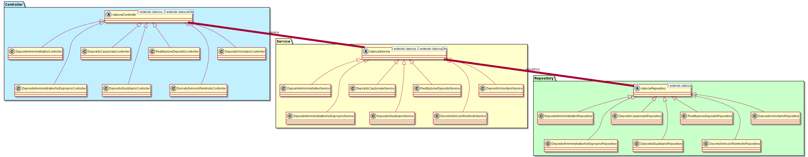
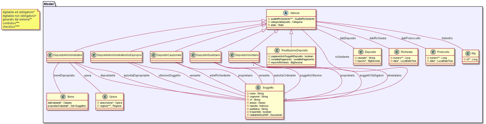

# 2.1.36	Servizi Comuni Istanze e Provvedimento di svincolo/reintroito

Servizi di inserimento istanza di costituzione e di restituzione e inserimento provvedimento di svincolo/reintroito

## 2.1.36.1 Inserimento Istanza Costituzione Deposito Cauzionale

### INPUT
* ModalitàTrasmissione
* Richiesta (con codice bollo)
* Richiedente
* Proprietario
* Ente
* Deposito
* Allegati
   
### DO	
* verifica presenza tutti soggetti
* inserimento nuovi soggetti
* inserimento istanza codice bollo + associazioni ai soggetti
* iserimento documenti (domanda+allegati) NEL FASCICOLO DELLA RTS ?

### OUTPUT
* Messaggio successo / errore

## 2.1.36.2 Inserimento Istanza Costituzione Deposito giudiziari 
   
### INPUT
* ModalitàTrasmissione
* Richiesta
* Richiedente
* Versante
* AutoritàOrdinante
* SoggettoUlteriore
* Deposito
* Allegati
   
### DO	
* verifica presenza tutti soggetti
* inserimento nuovi soggetti
* inserimento istanza codice bollo + associazioni ai soggetti
* iserimento documenti (domanda+allegati) NEL FASCICOLO DELLA RTS ?

### OUTPUT
* Messaggio successo / errore

## 2.1.36.3	Servizio Inserimento Istanza costituzione deposito Amministrativo per esproprio
   
### INPUT
* ModalitàTrasmissione
* Richiesta
* Richiedente
* Depositante
* AutoritàEspropriate
* Opera
* BeneEspropriato
* ProprietariCatastali
* Deposito
* Allegati
   
### DO	
* verifica presenza tutti soggetti
* inserimento nuovi soggetti
* IF ModalitàTrasmissione = "Manuale"
			verifica esistenza particelle catastali tramite Servizio Catasto (verifica non bloccante)
* inserimento istanza codice bollo + associazioni ai soggetti
* iserimento documenti (domanda+allegati) NEL FASCICOLO DELLA RTS ?

### OUTPUT
* Messaggio successo / errore

## 2.1.36.4	Servizio Inserimento Istanza costituzione deposito amministrativo diverso da esproprio
   
### INPUT
* ModalitàTrasmissione
* Richiesta
* Richiedente
* Versante
* AutoritàOrdinate
* SoggettoUlteriore
* Deposito
* Allegati
   
### DO
* verifica presenza tutti soggetti
* inserimento nuovi soggetti
* inserimento istanza codice bollo + associazioni ai soggetti
* iserimento documenti (domanda+allegati) NEL FASCICOLO DELLA RTS ?

### OUTPUT
* Messaggio successo / errore

## 2.1.36.5	Servizio Inserimento Istanza costituzione deposito volontario
   
### INPUT
* ModalitàTrasmissione
* Richiesta
* Richiedente
* Proprietario
* Deposito
* Allegati
 
### DO
* verifica presenza tutti soggetti
* inserimento nuovi soggetti
* inserimento istanza codice bollo + associazioni ai soggetti
* iserimento documenti (domanda+allegati) NEL FASCICOLO DELLA RTS ?

### OUTPUT
* Messaggio successo / errore

## 2.1.36.6	Servizio Inserimento Istanza restituzione

### INPUT
* ModalitàTrasmissione
* Richiesta (con codice PagoPA IF Deposito)
* Richiedente
* Soggetti (max 4)
* Beneficiario (con modalità pagamento)
* Deposito
* Allegati
   
### DO
* verifica presenza tutti soggetti
* inserimento nuovi soggetti
* inserimento istanza codice bollo + associazioni ai soggetti + associazioni al deposito
* Associazione dell’istanza al dettaglio (deposito/beneficiario) del provvedimento di svincolo nel caso sia esistente
* inserimento modalità pagamento istanza e beneficiario
* associazione istanza al dettaglio (deposito/beneficiario) del provvedimento di svincolo IF EXISTS
* iserimento documenti (domanda+allegati) nel fascicolo DEPOSITO

### OUTPUT
* Messaggio successo / errore

## 2.1.36.7	Servizio Inserimento Decreto Svincolo/reintroito
   
### INPUT
* Modalità di trasmissione (Manuale o Portale Servizi DAG)
* Categoria dei depositi
* Estremi del provvedimento di svincolo/reintroito 
* Estremi del provvedimento di espropriazione (solo per amministrativi per esproprio)
* Lista depositi
* Lista beneficiari per deposito
* Dichiarazioni
* Provvedimento di svincolo/reintroito ed ulteriori documenti in formato pdf    

### DO
* Verifica nella presenza in banca dati di tutti i soggetti ed inserimento dei nuovi 
* Inserimento del provvedimento ed associazione ai depositi e ai relativi beneficiari
* inserimento dei documenti (domanda ed allegati) nel fascicolo della RTS.

### OUTPUT
* Messaggio successo / errore
